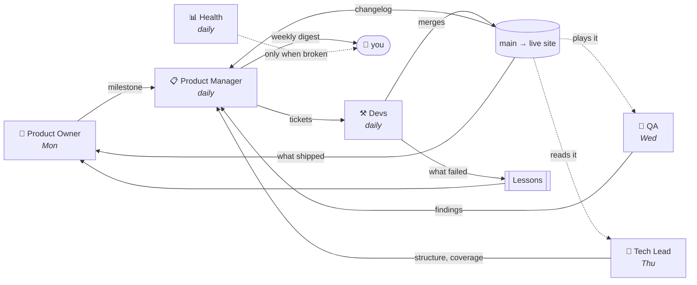
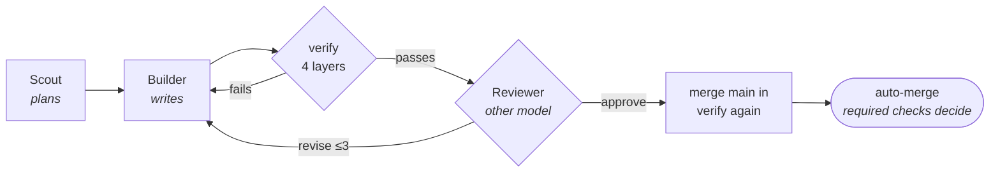
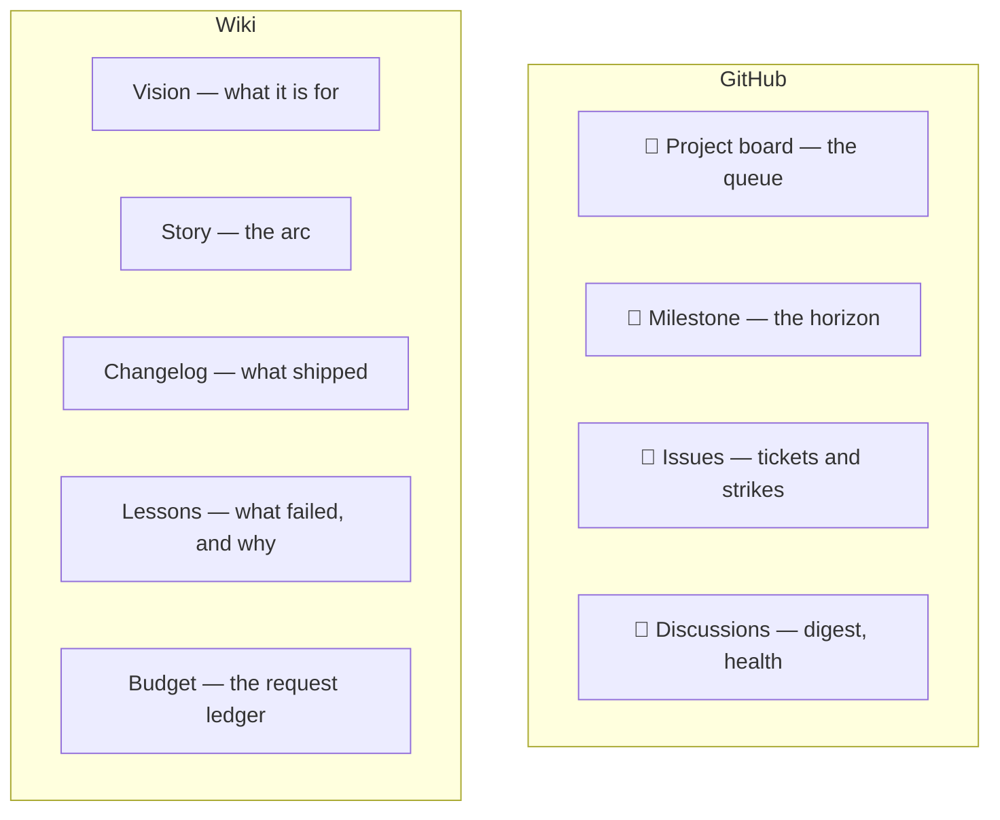

# selfgrow

[](https://github.com/DavidCorrea/selfgrow/actions/workflows/ci.yml)

**A software team that runs itself.** Four agent roles decide what to build, build it, review each other, verify the result in a real browser, and merge to `main` — with no human in the loop.

The product is a variable: what lives in `docs/` is whatever the pipeline has been growing lately, and `reset` exists to throw it away and keep the machine. So this is about the machine. The one thing it demands of any product is [a self-check contract](#the-product-contract).

🌱 **[See the garden](https://davidcorrea.github.io/selfgrow/)**

---

## The loop



Everything points forward *and* back. The return paths took the longest to build — a pipeline that only pushes work downstream cannot tell it is drifting.

## The team

Four roles, split by **whose judgement a decision needs** — which is why there are four and not eleven.

| Role | Runs | Owns | Writes to |
| --- | --- | --- | --- |
| 🧭 **Product Owner** | Mon 08:00 | Where the project is going | Vision, milestone, Lessons |
| 📋 **Product Manager** | daily 00:30 | What the product should and shouldn't be | issues, board, Story, digest |
| 🔧 **Tech Lead** | Thu 09:00 | Whether the code can absorb the next ticket | structure + coverage tickets |
| ⚒️ **Devs** | after the PM, + 14:00 mop-up | How a ticket gets built | `main` |

Plus one tester and three pieces of infrastructure — jobs, not roles:

| | Runs | Does |
| --- | --- | --- |
| 👀 **QA** | Wed 10:00 | Plays the **live site** for two minutes, files what it was like |
| 📊 **Health** | daily 16:00 | Measures the pipeline; silent unless something breaks |
| 🤝 **review-pr** / **triage-fork-pr** | on any PR | Finishes yours; reviews a stranger's |
| 📦 **pi-update** | Tue 07:00 | Dependabot for the model chain |

<details>
<summary><b>Why these four</b></summary>

**The PO looks back to point forward.** Its retro reads what shipped, what got parked and what QA keeps saying, then sets the milestone. Priority alone says which ticket is next; without a milestone the backlog fills by adjacency — every ticket found beside whatever shipped last, each sound, the whole adding up to nothing.

**The PM adds and subtracts in one breath.** What the product should stop doing is the same judgement as what it should start doing. Split across two roles, the subtractive half proposed removals blind to what the additive half was adding that week.

**The Tech Lead is the only role that sees the whole codebase.** Everything else in engineering is scoped to one ticket. It owns structure, owns `docs/selftest.js` — the only independent judge in the pipeline — and rules on tickets the Devs gave up on, because *"why did this fail"* is a technical question.

**QA is deliberately not the PM.** It plays and reports; the PM decides. The observer should not be the one who acts on the observation — the same reason the Devs do not review their own work.

**Sunday and Monday are the hinge.** The PM's Sunday run curates and writes the week's report; the PO reads that week on Monday and sets the milestone the PM grooms against for the next six days.

</details>

## How one ticket ships



- **Scout** plans the highest-priority buildable ticket. It does not judge whether the ticket should exist — the PM settled that at 00:30.
- **verify** runs cheapest-first: `node --check` → ESLint → a real Chromium page load → the product's own `checks()`.
- **Reviewer** is drawn from a *different model* than wrote the code. Review is only worth its request if it can disagree.
- **auto-merge** means the agent asks and the required checks answer — it no longer merges on its own say-so.

Failure is first-class: a ticket accrues strikes, gets parked, and the Tech Lead decides whether it returns smaller or not at all. Every dead end becomes a post-mortem the *next* Scout reads.

## What holds it together

| | |
| --- | --- |
| 💰 **Budget** | A shared daily ledger on the wiki counts real requests against 1000/day. Enforced at four points, because three of them have each been the hole. |
| ⏱️ **Time** | Every limit nested so the agent stops itself first. A run killed mid-ticket leaves an orphaned branch; one that stops itself does not. |
| 🔒 **Concurrency** | One `agent-main-writer` lock. Every wiki write is a retried read-modify-write — the naive version lost a race on ~100 consecutive merges and reported success each time. |
| 🎲 **Models** | An ordered fallback chain: a cheap paid head, then five free models from four provider families, ordered by envelope reliability. Re-probed weekly. |
| ✅ **Enforcement** | `check` and `verify-product` are **required** on `main`. Before, every guarantee was self-imposed — the agents graded their own work and merged on the result. |
| 📊 **Watching** | Health asks whether the week looks like a working one, including whether the deployed site is up. No model, no key — it must keep working on a day the budget is spent. |

## The product contract

The only thing the machine requires of what it builds. `docs/` is a static site with an `index.html`, and it exports one function:

```js
// docs/selftest.js
export async function checks() {
  // Plain-language failure messages; empty when everything holds.
  return [];
}
```

Every message it returns blocks the merge. Syntax, lint and a clean page load prove the code *runs*; only this proves it still does what it claims — the failure most likely to ship, because everything else looks green.

## Where memory lives

Agents are stateless; every run starts from a fresh checkout.



Changelog and Lessons are trimmed: both are read whole into prompts, and an untrimmed page is a context window quietly filling up.

## Contributing

**File an issue** and the PM picks it up next morning. The [forms](.github/ISSUE_TEMPLATE) ask two things — what should change, and how you would know it worked — because that is what the agents build toward.

Your ticket can be **sharpened but never closed for being unclear.** Grooming closes what it cannot describe concretely, and a request typed quickly is exactly that shape; the one channel into this system used to end in a silent drop. Closing it now requires declaring it out of scope, which is a judgement about the *request* rather than the wording.

**Open a PR** and the Devs take it the rest of the way — verified, reviewed, fixed if it needs it, merged. Opening it is the contribution; you are not also the maintainer of it. Two lines they will not cross: **never close your PR** (your branch stays intact, and fixes are separate commits you can drop), and **never merge what has not passed verify**.

**From a fork?** You get a review, but nothing runs your code — that path would hand a stranger the account's API key. The diff is read as text, judged against the project's own source, and answered in a comment. Expect *"this already shipped"* more often than not: agents work the same tickets you do.

## Being told what happened

Two channels, both **Discussions**, neither asking anything of you.

- 📢 **Weekly digest**, Sundays — what the garden grew, grouped by what the work adds up to rather than by ticket; what you asked for and what became of it; what is stuck. It `@`-mentions you.
- 🚨 **Health alerts**, only when something breaks — one open post naming everything wrong, which **closes itself** once none of it is true. Silence means fine.

## Running it

| Secret | For |
| --- | --- |
| `OPENROUTER_API_KEY` | every model call |
| `AGENT_PAT` | issues, board, milestones, wiki, approving PRs |
| `GITHUB_TOKEN` | opening PRs as a second identity *(built in)* |

The PAT needs `project` scope. Set `GH_PROJECT_OWNER` / `GH_PROJECT_NUMBER` to point at your board.

```bash
npm test        # the harness's own suite
npm run lint    # agents/ and docs/
```

**To start over:** pause the workflows and dispatch `reset`, typing the repository name to confirm. It cancels runs, closes issues and agent PRs, clears the board, resets the wiki's memory, and deletes the product from `main` — leaving the machine, an empty `docs/`, and a full night's budget.
