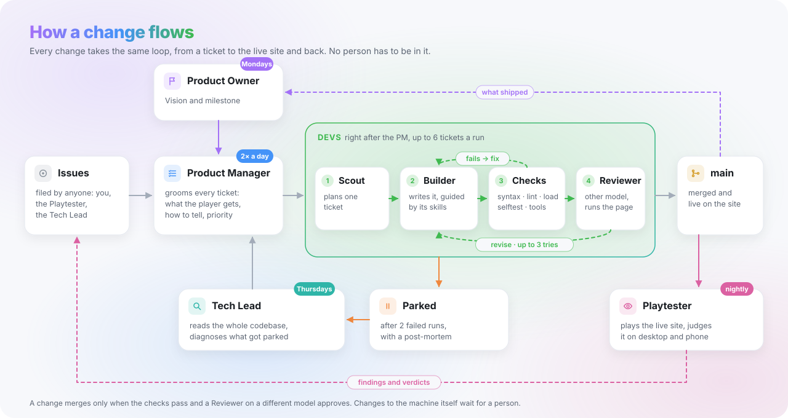

# selfgrow

[](https://github.com/DavidCorrea/selfgrow/actions/workflows/ci.yml)

**A software team that runs itself.** Agent roles decide what to build, build it, review each other, check the result in a real browser, and merge to `main` with no human in the loop.

The product in `docs/` is a variable: `reset` throws it away and keeps the machine. So this is about the machine.

🌱 **[See the live product](https://davidcorrea.github.io/selfgrow/)**

## How a change flows

<picture>
  <source media="(prefers-color-scheme: dark)" srcset=".github/readme/flow-dark.svg">
  
</picture>

1. **Anyone files an issue:** you, the Playtester after a session, the Tech Lead after reading the code, or the Builder when it finds tech debt.
2. **The Product Manager grooms it.** It says what the player gets, how to tell it shipped, its priority, and what it waits on. Only groomed tickets can be built, and the [Product Owner](agents/prompts/product-owner.md)'s weekly milestone says which matter most.
3. **The Devs build it.** The [Scout](agents/prompts/scout.md) plans one ticket, and the [Builder](agents/prompts/builder.md) writes it, guided by [skills](agents/skills/) for design, polish, hardening, performance and fixing bugs at their cause.
4. **The checks run:** syntax, lint, a real page load, the product's own self-checks, its agent tools, and its skills ([`verify.mjs`](agents/verify.mjs)). A failure goes back to the Builder.
5. **A Reviewer on a different model judges it.** It reads the diff, runs the page through the change's claim, and hunts for bugs ([`reviewer.md`](agents/prompts/reviewer.md)). A revise goes back to the Builder, up to 3 tries per run.
6. **It merges to `main`,** and GitHub Pages publishes it.
7. **The Playtester plays the live site every night** on desktop and phone, and files what a person would notice. Its verdicts close earlier findings or escalate them.

A ticket that fails two runs is **parked** with a post-mortem, and the Tech Lead diagnoses it so the Product Manager can split or retire it.

## Who does what

| | Runs (UTC) | Decides |
| --- | --- | --- |
| 🧭 **Product Owner** | Mon 08:00 | The Vision and the week's milestone |
| 📋 **Product Manager** | daily 00:30 + 12:30 | What gets built, in what order, and what "done" means. Writes the Sunday digest |
| ⚒️ **Devs** | after the PM, + daily 14:00 | How to build a ticket, and whether a build is good enough to merge |
| 🔧 **Tech Lead** | Thu 09:00 | Whether the codebase still holds together; why parked tickets failed |
| 👀 **Playtester** | daily 23:00 | Whether the product is any good to be in front of |
| 📊 **Health** | daily 16:00 | Nothing. It watches the pipeline and speaks only when something is broken |
| 🤝 **review-pr** / **triage-fork-pr** | on any PR | Finish a person's PR; review a fork's as text |
| 📦 **pi-update** | Tue 07:00 | Keeps the agent runtime current, and reverts if the model chain breaks |

<details>
<summary>The week at a glance</summary>

| UTC | Mon | Tue | Wed | Thu | Fri | Sat | Sun |
| --- | --- | --- | --- | --- | --- | --- | --- |
| 00:30 | 📋 PM | 📋 PM | 📋 PM | 📋 PM | 📋 PM | 📋 PM | 📋 PM + digest |
| 07:00 | | 📦 pi-update | | | | | |
| 08:00 | 🧭 PO | | | | | | |
| 09:00 | | | | 🔧 Tech Lead | | | |
| 12:30 | 📋 PM | 📋 PM | 📋 PM | 📋 PM | 📋 PM | 📋 PM | 📋 PM |
| 14:00 | ⚒️ Devs | ⚒️ Devs | ⚒️ Devs | ⚒️ Devs | ⚒️ Devs | ⚒️ Devs | ⚒️ Devs |
| 16:00 | 📊 Health | 📊 Health | 📊 Health | 📊 Health | 📊 Health | 📊 Health | 📊 Health |
| 23:00 | 👀 Playtester | 👀 Playtester | 👀 Playtester | 👀 Playtester | 👀 Playtester | 👀 Playtester | 👀 Playtester |

The Devs also start right after each PM run that leaves groomed work, and keep going while tickets become buildable, up to 6 a run. The Playtester plays at 23:00 so its findings are waiting for the PM's next run.

</details>

## What keeps it honest

- **Nothing merges on an agent's word.** The checks must pass, and approval comes from a Reviewer drawn from a different model than the Builder.
- **A shipped ticket is not a fixed problem.** A finding stays open until the Playtester says what it saw has changed.
- **A failed read is never an empty one.** A GitHub listing that fails or truncates throws instead of answering "nothing there", so nothing is duplicated or dropped on a bad day ([`DOMAIN.md`](DOMAIN.md)).
- **The machine is changed by people.** Agents build only in `docs/`; changes to `agents/`, `.github/` or the dependencies wait for a person to merge.

## What it remembers

- **The board:** every ticket and its state.
- **The wiki:** the [Vision](https://github.com/DavidCorrea/selfgrow/wiki/Vision) (the one input every role derives from), the Changelog, and the Story of each week.
- **Discussions:** each role's journal, lessons learned, settled decisions, ideas, the Sunday digest and Health alerts.

A reset keeps the machine's lessons and decisions and archives the product's.

## The product contract

Whatever the product is, `docs/` is a static site with an `index.html` that exports its own checks:

```js
// docs/selftest.js
export async function checks() {
  return []; // plain-language failure messages; empty when everything holds
}
```

Every message it returns blocks the merge. Beyond that, every product here is [tended by agents, usable by agents, at home on any screen, and welcoming to everyone](agents/prompts/_machine-principles.md).

## Contributing

- **File an issue.** The PM grooms it at its next run (00:30 or 12:30 UTC). It can be sharpened, but never closed for being unclear.
- **Open a PR.** The Devs verify, review and finish it, never close it, and never merge what fails verify. Changes to `.github/`, `agents/` or the dependencies wait for a person to merge.
- **From a fork?** Your diff is reviewed as text and answered in a comment; nothing runs your code.

## Running it

<details>
<summary>Secrets, commands, and starting over</summary>

| Secret | For |
| --- | --- |
| `OPENROUTER_API_KEY` | every model call. **Set a spend cap on it**: that cap is the pipeline's only spending limit |
| `AGENT_PAT` | issues, board, milestones, wiki, opening PRs (needs `project` scope) |
| `GITHUB_TOKEN` | approving PRs as a second identity (built in) |

Set `GH_PROJECT_OWNER` / `GH_PROJECT_NUMBER` to point at your board.

```bash
npm test        # the harness's own suite
npm run lint    # agents/ and docs/
```

You hear from it in Discussions: a weekly digest on Sundays, and a Health alert only when something breaks, which closes itself once it is fixed.

**To pause it,** disable the agent workflows in the Actions tab.

**To start over,** pause the workflows and dispatch `reset`, typing the repository name to confirm. It deletes the product and keeps the machine. Then write the new Vision in the wiki, re-enable the workflows, and dispatch the Product Manager.

</details>

## More

- [`DOMAIN.md`](DOMAIN.md): why everything is the way it is
- [`STRUCTURE.md`](STRUCTURE.md): where the code lives
- [`IMPROVEMENTS.md`](IMPROVEMENTS.md): known gaps
