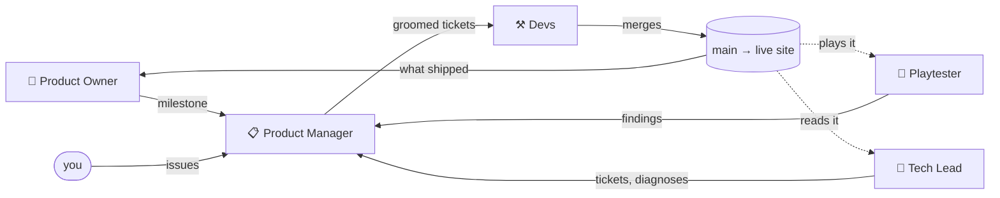

# selfgrow

[](https://github.com/DavidCorrea/selfgrow/actions/workflows/ci.yml)

**A software team that runs itself.** Agent roles decide what to build, build it, review each other, verify the result in a real browser, and merge to `main` with no human in the loop.

The product in `docs/` is a variable: `reset` throws it away and keeps the machine. So this is about the machine.

🌱 **[See the live product](https://davidcorrea.github.io/selfgrow/)**

## How it works


```mermaid
flowchart LR
    PO["🧭 Product Owner"] -->|milestone| PM["📋 Product Manager"]
    QA["👀 Playtester"] -->|findings| PM
    TL["🔧 Tech Lead"] -->|tickets, diagnoses| PM
    YOU(["you"]) -->|issues| PM
    PM -->|groomed tickets| DEV["⚒️ Devs"]
    DEV -->|merges| MAIN[("main → live site")]
    MAIN -.->|plays it| QA
    MAIN -.->|reads it| TL
    MAIN -->|what shipped| PO
```

Anyone can file a ticket; only the Product Manager marks one ready, and the Devs build nothing else.

| | Runs | Does |
| --- | --- | --- |
| 🧭 **Product Owner** | Mon 08:00 | Sets the Vision and the milestone |
| 📋 **Product Manager** | daily 00:30 | Grooms every ticket: what the player gets, how to tell it shipped, and its priority. Decides parked tickets. Writes the Sunday digest |
| ⚒️ **Devs** | after the PM, + 14:00 | Plan, build, verify, review with a different model, merge |
| 🔧 **Tech Lead** | Thu 09:00 | Reads the whole codebase and the self-check suite; diagnoses tickets the Devs gave up on |
| 👀 **Playtester** | daily 23:00 | Plays the live site, reads App Review's layout measurements, files what a player would notice |
| 📊 **Health** | daily 16:00 | Watches the pipeline; speaks only when something is broken |
| 🤝 **review-pr** / **triage-fork-pr** | on any PR | Finishes a person's PR; reviews a fork's as text |
| 📦 **pi-update** | Tue 07:00 | Keeps the model chain current |

## The product contract

The one thing the machine requires of any product: `docs/` is a static site with an `index.html`, and it exports its own checks.

```js
// docs/selftest.js
export async function checks() {
  return []; // plain-language failure messages; empty when everything holds
}
```

Every message it returns blocks the merge.

## Contributing

- **File an issue.** The PM grooms it the next morning. It can be sharpened, but never closed for being unclear.
- **Open a PR.** The Devs verify, review and finish it, never close it, and never merge what fails verify. Changes to `.github/`, `agents/` or the dependencies wait for a person to merge.
- **From a fork?** Your diff is reviewed as text and answered in a comment; nothing runs your code.

## Running it

| Secret | For |
| --- | --- |
| `OPENROUTER_API_KEY` | every model call. **Set a spend cap on it**: that cap is the pipeline's only spending limit |
| `AGENT_PAT` | issues, board, milestones, wiki, opening PRs (needs `project` scope) |
| `GITHUB_TOKEN` | approving PRs as a second identity (built in) |

Set `GH_PROJECT_OWNER` / `GH_PROJECT_NUMBER` to point at your board.

```bash
npm test        # the harness's own suite
npm run lint    # agents/ and docs/
```

You hear from it in Discussions: a weekly digest on Sundays, and a Health alert only when something breaks, which closes itself once it is fixed.

**To start over,** pause the workflows and dispatch `reset`, typing the repository name to confirm. It deletes the product and keeps the machine.

## More

- [`DOMAIN.md`](DOMAIN.md): why everything is the way it is
- [`STRUCTURE.md`](STRUCTURE.md): where the code lives
- [`IMPROVEMENTS.md`](IMPROVEMENTS.md): known gaps
